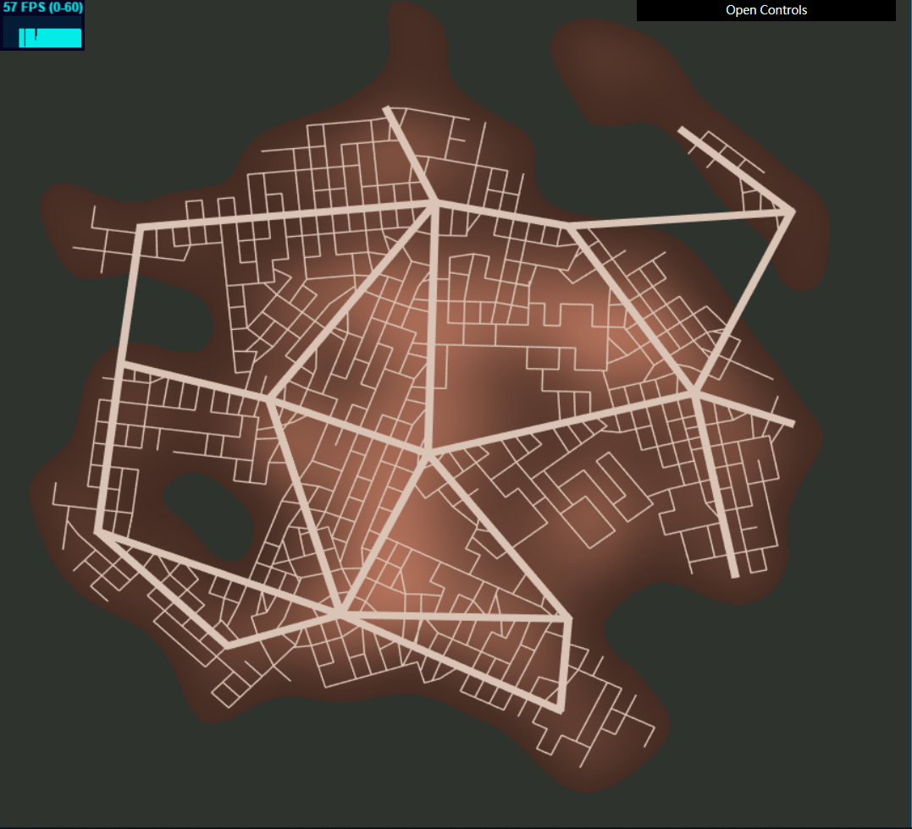

# CIS 566 Homework 5: Road Generation

## ID
 - __Name:__ Jiangping Xu
 - __PennKey:__ xjp

Demo
---------
https://haco77.github.io/hw05-road-generation/

Implementation Details
----------
- Population and Elevation. I use the Perlin noise with different seeds to generate these two map. Pixel values are decayed according to the distance to the center of noise map, so the elevation at the boundry of the map is under sea level with zero population density. The data then is stored in ImageData variables and send to the gpu side as two textures. I use an uniform variable to store the current display mode, and decide which texture is being used according this variable.

- Highway Generation. I divide the map into 64 (8 * 8) cells. In each cell a peak population density position is recorded. Then I move the positions that are too close to each other to their center location, because a really short highway isn't what we want. Finally highways are generated between the population peaks in neighbour cells.

- Street Generation. I iterate the highways generated in last step, expanding streets on both sides using a pseudo L-system. For each Highway, I divide it into segments with equal length. Two turtles are deployed on each segment endpoint, walking in two directions that perpendicular to the highway. For each step, a random number is generated to determine whether the current turtle position should push into the stack. Then other random numbers are generated to decide the forwarding direction. Only directions that are perpendicular or parallel to the highway are possible. When a turtle wants to move forward, I will check the nearest road of the forwarding position. If there is a road that is too close to the turtle's next position, I will change the destination of the turtle to that nearest point. Then I will pop the stack and reset the turtle to last recorded position. If the stack is empty, then the turtle has completed its task. Each time a turtle moves forward, a corresponding street is generated. Streets and highways are stored in array of vec4s. The first and last two numbers of a vec4 store the start and end positions of a road. Another array of numbers is used to record the types of the roads (i.e., 0 for highways and 1 for streets). I also use a boolean array to record whether a position on the map has been visited. Before a turtle moving I will check if the target position has already been visited. If so, I will turn the turtle to another moving direction.       

Scene Shot
---------
